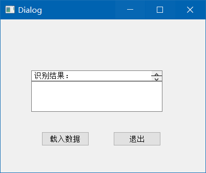
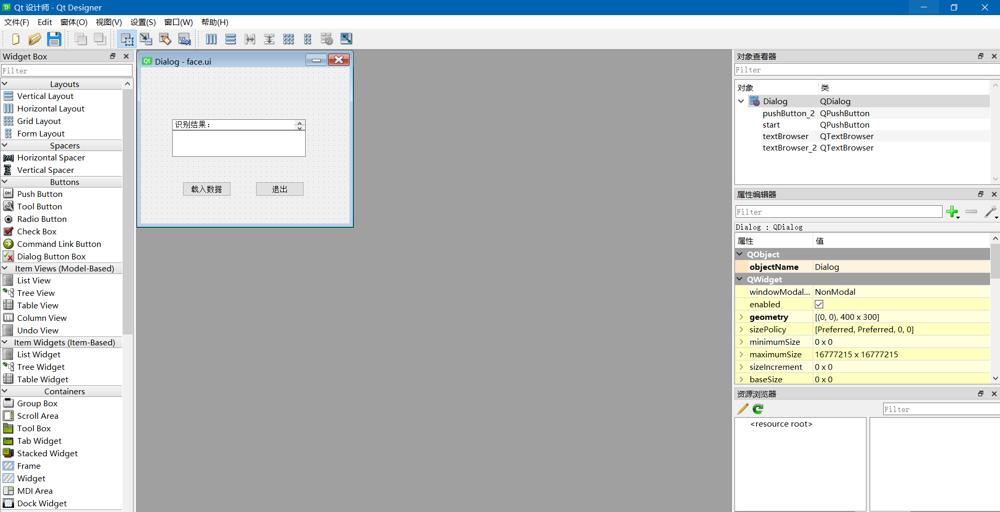

# 电话识别报告

## 主要实现

通过python的```PyQt```实现图形化界面设计和绑定生成。调用```wave```读取波形。调用python的信号处理相关包```numpy，scipy.signal```对信号进行处理。调用```pyinstaller```打包程序。

## ui设计



载入数据选择音频，退出就是退出程序。

## 实现细节

### 设计ui



Qt Designer 提供了现成的ui设计器，直接拖动窗体即可。

### 分割信号

对信号进行滤波和归一化处理后，对信号设置一定的阈值，可以滤去强度不足的杂音。

``` python
# 0.15 magic number：阈值
for i in range(wave_data.shape[0]):
    if wave_data[i] < 0.15 * nor:
        wavetr[i] = 0
    else:
        wavetr[i] = 1
```

按照一段一段扫描信号，只有在段中有强度值达到一定阈值的才会被认为是稳定的电话拨号，而不是强干扰的短暂噪音。

``` python
    num = int(framerate / 40)
    right_end = wavetr.shape[0] - 2 * num
    left = []
    threshold = 43
    key = [0]
    j = 0
    
    while j <= right_end:
        test = 0
        for i in np.arange(j, num + j):
            test += np.abs(wavetr[i])
    
        if test > threshold:
            key.append(1)
        else:
            key.append(0)
        if key[-1] > key[-2]:
            left.append(j + int(num / 2))
        j += num

```

### fft分析

对分割好的信号进行1024点的fft，得到的结果和表格进行对比，找出偏差不过大的信号

``` python

def fft_deal(data, framerate, left0):
    f = []
    treat_data = data[left0 - 512:left0 + 511].copy()

    fftx = np.fft.fft(treat_data, 1024)
    fftx = np.fft.fftshift(fftx)
    absfft = np.abs(fftx) / 1024
    for i in range(10):
        arg = np.argmax(absfft)
        is_new_freq = True
        temp = -framerate / 2 + arg * framerate / 1024
        for j in range(len(f)):
            if np.abs(temp - f[j]) < 50:
                is_new_freq = False
        if is_new_freq:
            f.append(temp)
        absfft[arg] = 0
    f = np.abs(np.array(f))
    f = np.sort(np.unique(f))

    for i in range(len(database)):
        if np.abs(f[0] - LowFreq[i]) < 70:
            if np.abs(f[1] - HighFreq[i]) < 70:
                return database[i]
```
